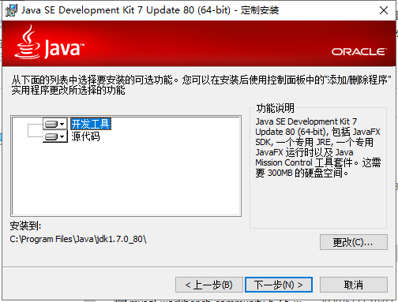
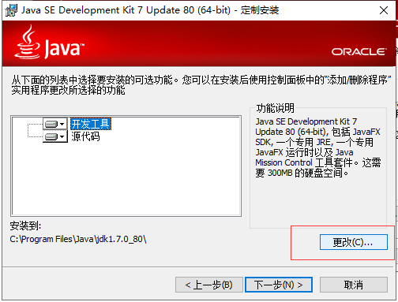
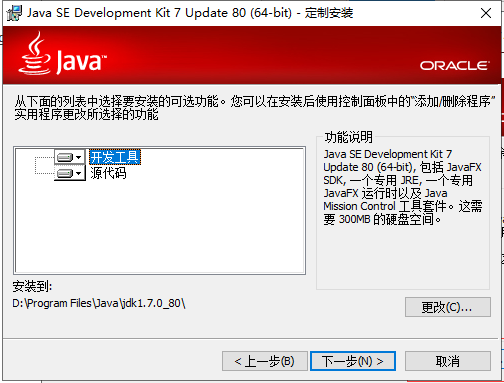
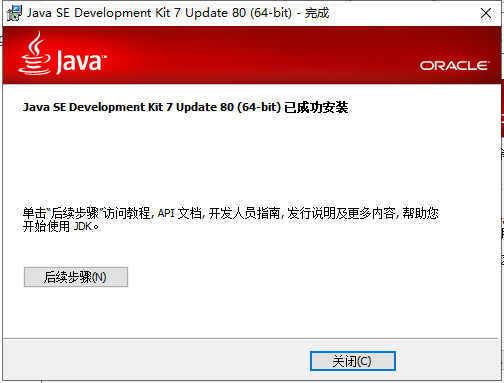
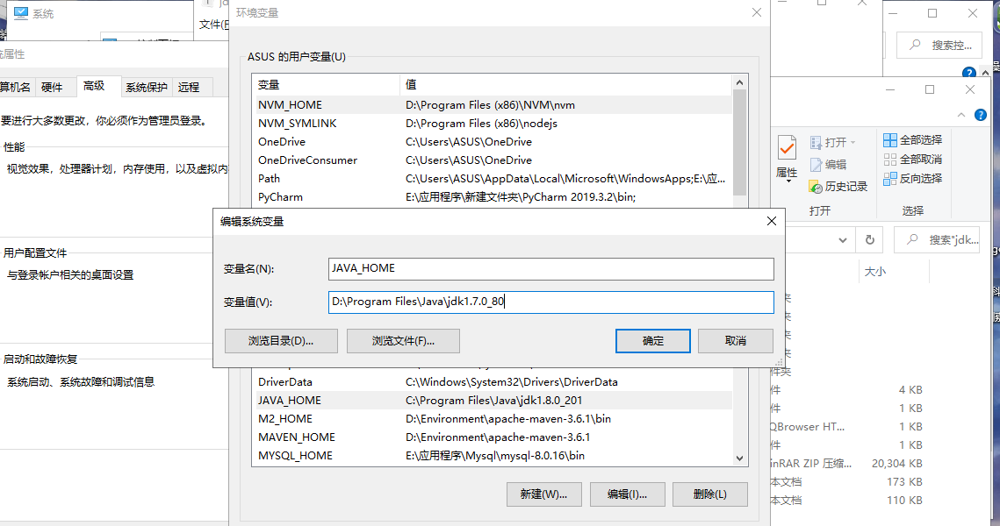
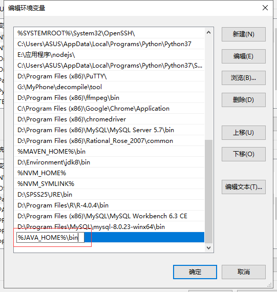

### jdk安装









### 配置环境

将jdk安装目录设为系统环境变量，在系统变量中添加  JAVA_HOME  变量，变量值为jdk安装路径，之后在  path  中添加  %JAVA_HOME%\bin  使javac等java运行程序可被系统访问






### 测试运行

创建一个名为Hello_World.java 的文件（因为java文件的名称和类名必须保持一致）

```java
public class Hello_World{
       public static void main(String str[]){
                    System.out.println("Hello World!");
              }
       }
```

在cmd中执行以下命令：

cd [文件路径名]              ###转到文件所在路径下###

javac Hello_World.java

java Hello_World

最后输出"Hello World!"则表明安装与配置成功